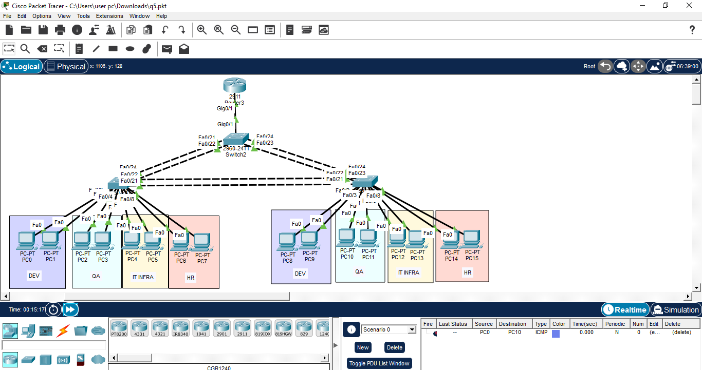
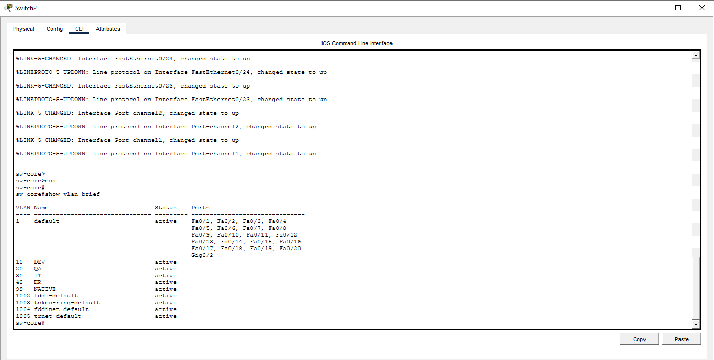
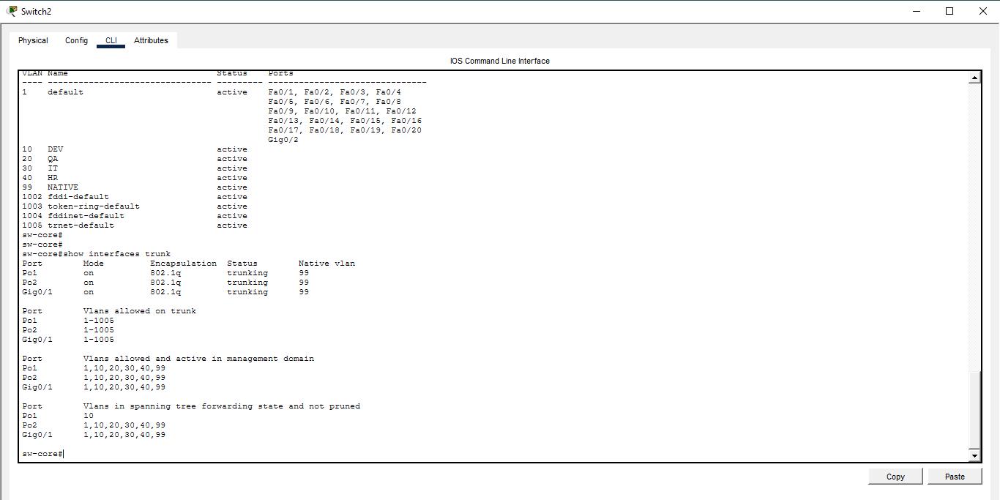
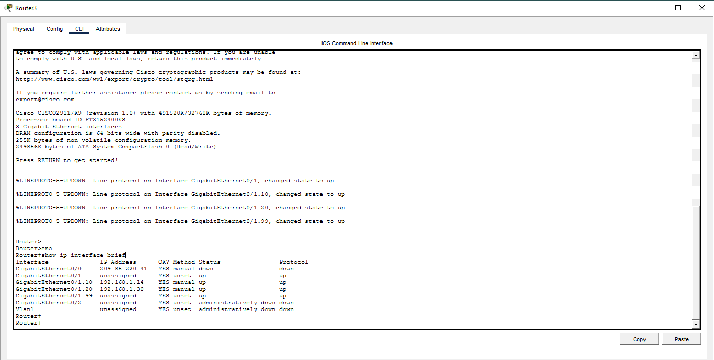
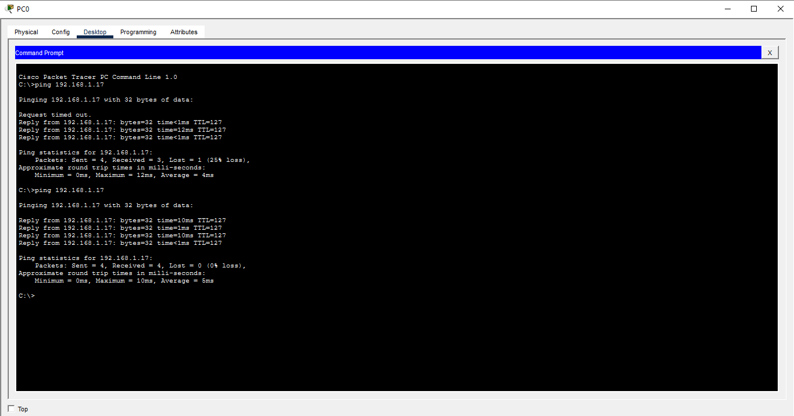

# Enterprise VLAN Network Design — Cisco Packet Tracer

## Overview
This project simulates a segmented enterprise network built in Cisco Packet Tracer as part of
my practical networking coursework. The design connects 6 departments (Dev, QA, IT Infra, HR)
using VLANs across two distribution switches and a core switch, with a router providing
WAN/internet gateway access and inter-VLAN routing for the whole network.

## Topology Diagram


- **Router0:** Performs inter-VLAN routing (router-on-a-stick) and connects the network to the internet/WAN via a cloud connection.
- **SW-CORE:** Core switch — trunks connect it to Router0 and both distribution switches.
- **SW-DIST-A:** Distribution switch serving the Dev and QA departments.
- **SW-DIST-B:** Distribution switch serving the IT Infra and HR departments.

## Devices Used
| Device        | Hostname   | Role                                     |
|---------------|------------|--------------------------------------------|
| Router 2911   | Router0    | Inter-VLAN routing, WAN/internet gateway    |
| Switch 2960   | SW-CORE    | Core switching, trunk aggregation           |
| Switch 2960   | SW-DIST-A  | Access switching for Dev, QA                |
| Switch 2960   | SW-DIST-B  | Access switching for IT Infra, HR           |
| PC-PT         | —          | 16 end-user devices across 4 departments    |

## IP Addressing Plan
The base network **192.168.1.0/26** was subnetted into four /28 blocks (16 addresses each,
14 usable hosts) — one per department.

| VLAN | Department  | Network         | Usable Range                  | Broadcast       | Subnet Mask       | Gateway (Router0) |
|------|-------------|-----------------|--------------------------------|------------------|-------------------|---------------------|
| 10   | Development | 192.168.1.0/28  | 192.168.1.1 – 192.168.1.14     | 192.168.1.15     | 255.255.255.240   | 192.168.1.1         |
| 20   | QA          | 192.168.1.16/28 | 192.168.1.17 – 192.168.1.30    | 192.168.1.31     | 255.255.255.240   | 192.168.1.17        |
| 30   | IT Infra    | 192.168.1.32/28 | 192.168.1.33 – 192.168.1.46    | 192.168.1.47     | 255.255.255.240   | 192.168.1.33        |
| 40   | HR          | 192.168.1.48/28 | 192.168.1.49 – 192.168.1.62    | 192.168.1.63     | 255.255.255.240   | 192.168.1.49        |

VLAN 99 was configured as the native VLAN on all trunk links.

## Configuration Highlights

**Router0 — router-on-a-stick sub-interfaces:**
```
interface GigabitEthernet0/1.10
 encapsulation dot1Q 10
 ip address 192.168.1.1 255.255.255.240

interface GigabitEthernet0/1.20
 encapsulation dot1Q 20
 ip address 192.168.1.17 255.255.255.240
```

**SW-CORE — VLANs and trunk links:**
```
vlan 10
 name DEV
vlan 20
 name QA
vlan 30
 name IT
vlan 40
 name HR
vlan 99
 name NATIVE

interface range fastEthernet 0/21-24
 switchport mode trunk
 switchport trunk native vlan 99
```

**Distribution switches — access ports per department:**
```
interface range fastEthernet 0/1-2
 switchport mode access
 switchport access vlan 10
```

## Verification
Commands and tests used to confirm the network was working correctly:

- `show vlan brief` — confirms VLANs exist and access ports are assigned to the correct department.


- `show interfaces trunk` — confirms trunk links between switches and the router are active with the correct native VLAN and allowed VLAN list.


- `show ip interface brief` on Router0 — confirms all sub-interfaces are up and correctly addressed.


- `ping` between PCs in different departments — confirms inter-VLAN routing and connectivity across the network.


## Troubleshooting Notes
During testing, inter-department pings initially failed. Diagnosis with `show vlan brief` showed
all switch ports still sitting in the default VLAN 1, meaning the links between the core switch,
distribution switches, and router had not been trunked. Configuring `switchport mode trunk` on
the relevant port ranges (with a consistent native VLAN) resolved the issue and restored
end-to-end connectivity.

## Tools Used
- Cisco Packet Tracer

## Project File
The complete Packet Tracer file is available here: [`enterprise-vlan-network-design.pkt`](enterprise-vlan-network-design.pkt)

## Author
Nalaka Priyadarshana
BICT Undergraduate, University of Vavuniya
[LinkedIn](https://linkedin.com/in/nalakapriyadarshana) | [GitHub](https://github.com/Nalaka201)
